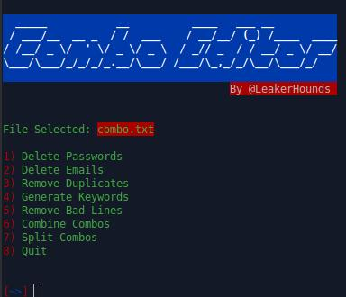

# Simple Combo Editor For Linux



# Table of contents:
* [General Information](#general-info)
* [Changleog](#changelog)
* [Features](#features)
* [Installation](#installation)
* [Email Config](#email_config)
* [Disclaimer](#disclaimer)
* [Credits](#credits)
* [Social Media](#social-media)
* [Bug Report](#bug-report)

# General Information
  
  Litte linux combo editor, just a creation of me and older version available on aut0_mak3r. If you have combos, then you can edit it with this editor. 
  The Domain sorter has more than 1 million unknown mail providers for the reason, that the combos might be more HQ if they have unknown emails.
  If you have any errors, go here: (#bug-report)
  

# Changelog


 ## In Progress:
 
  - [ ] Anti-Public Checker (Not Sure)
  - [ ] HQ Keywords Generation
  - [ ] Dorks Section (Not Sure)
  - [ ] New Menu 
  - [x] USER:PASS Options
  - [x] Randomizing Combos
 
 ## Already leaked:
 
  **Version 0.6**
  * Added USER:PASS Extraction
  * Added USER:PASS To PASS:USER
  * Added Soft & Hard Randomizing | Shuffling Combos
  * Added Domain Sorter
  * Added Credit Card Extractor
  
  **Version 0.5**
  * Added Better Menu
  * Added Exit Option
  * Fixed Bugs

  **Version 0.4**
  * Added Combine Combos
  * Added Split Combos
  * Fixed Bugs
  
  **Version 0.3**
  * Added Remove Badlines
  * Fixed Bugs
  
  **Version 0.2**
  * Added Generate "Keywords"
  * Fixed Bugs
  
  **[BETA] Version 0.1:**
  
  * Added Remove Emails And Passwords
  * Added Remove Duplicates


# Features
 
  * Delete Passwords (For Maillists/Leads)
  * Delete Emails (For Wordlists/Passlists)
  * Remove Duplicates (Sort & Removes Duplicates)
  * Generate Keywords (Generate English Usual Keywords)
  * Combine Combos (Combine Splitted Combos)
  * Split Combos (If You Have A Big Combo You Can Split It)
  * Extract USER:PASS (For Username & Password Logins, Such As Instagram)
  * USER:PASS to PASS:USER (For Whatever Reason, To Make Extract HQ Wordlists)
  * Soft & Hard Randomize Combos (Shuffling Combos - Means It Randomize The Lines)
  * Sort Domains (Domains Sorter - I Added Over 1mio.)
  * Extract Creditcard Data (For Carding Purpose)
  
# Disclaimer

  Use this tool for educational purposes only .:-) 🕵️‍♂️
  If you do any illegal attacks, i am not responsible for your tasks.
  Use this tool correctly, and do not re-upload it on your github repository without permissions.

# Installation

  For Linux/Termux:
  
  ```git clone https://github.com/rebl0x3r/combo_editor.git```
  
  ```cd combo_editor && chmod +rwx combo_editor.sh```

  Run:
  
  ```./combo_editor.sh -f combo.txt```
  
  Just replace the combo.txt with your combolist name.
  
# Email Config

  The Email config is used for the domain sorter, if you want to edit the file you need to use a strong editor.
  I recommend ```codium```, in Kali or any other system you can also use ```nano```.
  
  [1] First go to the directory of combo_editor
  
  ```cd combo_editor```

  [2] Edit the ```email.conf``` File
  
  ```codium email.conf```
  
  Alternatively you can add through ```echo``` domains:

  ```echo "@google.com >> email.conf; tail -5 email.conf```
  
  As you can see the last 5 lines, @google.com has been added successfully.
  
  Don't worry about duplicates i removed all duplicates and sorted the file.
  
  
# Credits

_Channels :_ 


[LeakerHounds](https://t.me/LeakerHounds)

[ViperZCrew](https://t.me/ViperZCrew)
         
[Deepwaterleaks](https://t.me/deepwaterleaks2)
               
               
_Coder & Contact :_
  
[TheMasterCH](https://wa.me/2348148949234)
                
                
                
# Social Media
Telegram:
* @TheMasterCH
* @On1c0n3


# Bug Report
  If you found any bug or issue, pless go [here](https://github.com/rebl0x3r/combo_editor/issues)
  You can also request an update.
